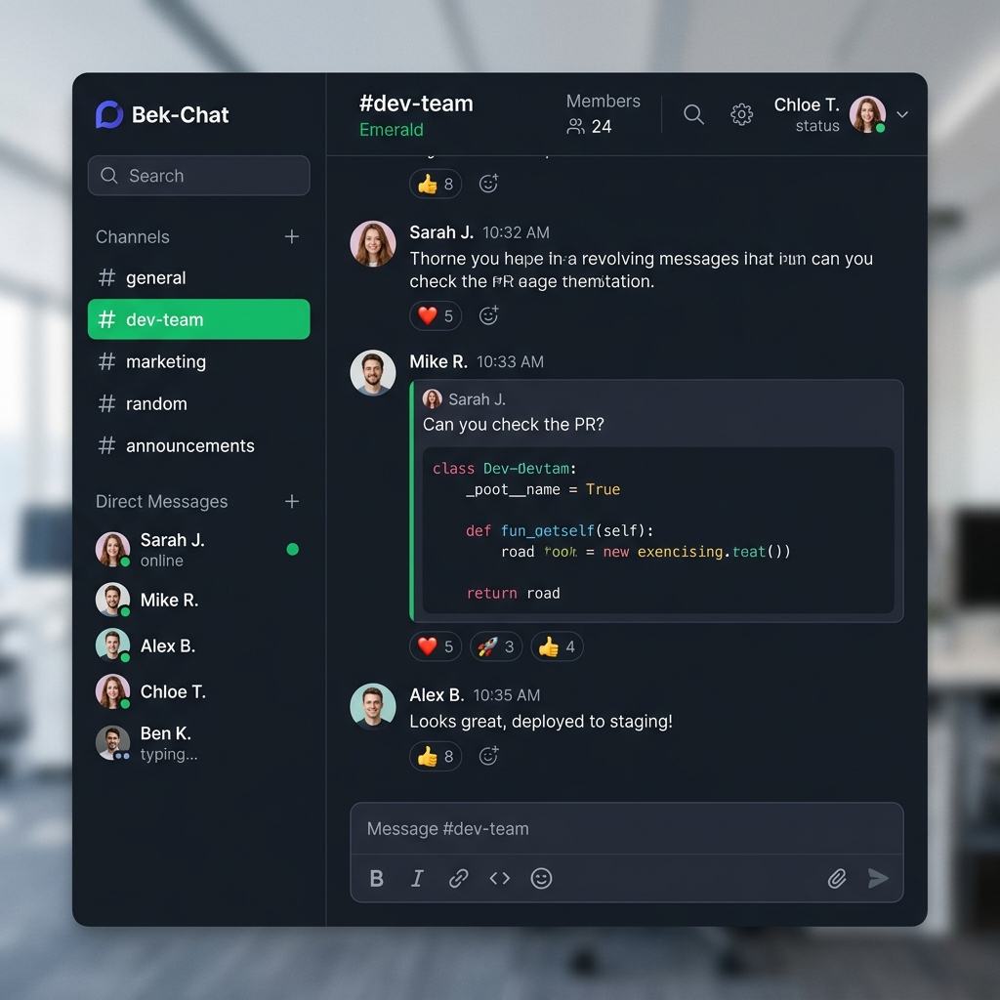

# Bek-Chat 🚀

> **Bek-Chat** is a high-performance, self-hostable, real-time team collaboration and messaging platform built with **React**, **NestJS**, **TypeScript**, **Prisma ORM**, **PostgreSQL**, **Redis**, and **WebSockets**.

Designed with modern Slack-style aesthetics, vibrant glassmorphic UI elements, dynamic Google Fonts CDN loading, incoming/outgoing webhooks, Telegram-style bot APIs, crowdsourced multi-language translations, and an interactive in-app notification center.

---

<p align="center">
  
</p>

---

## 🌟 Key Features

### 💬 Real-Time Chat & Slack/Telegram-Style Message Features
- **WebSocket & Redis Pub/Sub Engine**: Zero-latency channel messaging, direct messages, and typing indicators across distributed containers.
- **Telegram-Style Specific Message Replies**: Inline quoted reply cards with parent message content & sender snippets, click-to-scroll navigation, and interactive reply preview bar.
- **Rich Text Toolbar**: Bold, italic, underline, strikethrough, links, bullet/numbered lists, blockquotes, inline code, and code blocks.
- **Dynamic Auto-Expanding Input**: Message box smoothly auto-resizes as line height increases.
- **Syntax Highlighted Code Snippets**: Code block cards with language badges (`JS`, `PYTHON`, `JSON`, `HTML`) and 1-click **"Copy Code"** button.
- **User `@username` Mentions**: Autocomplete user dropdown while typing `@` and real-time mention alerts.

### 🔔 In-App Notification Center & Alerts
- **Navbar Bell Button & Badge**: Unread notification counter badge in the chat header.
- **Interactive Notification Drawer**: View unread mentions, direct message alerts, and system updates with quick **"Read All"** actions.
- **Browser Desktop Notifications & Sound Chimes**: Web push notifications and audio alert chimes with volume control.

### 🎨 Custom Google Fonts & Aesthetic Design System
- **Dynamic Google Fonts CDN Injector**: Load and apply any font family directly from [Google Fonts](https://fonts.google.com/) (e.g. `Google Sans`, `Poppins`, `Inter`, `Roboto`, `Kantumruy Pro`, `Battambang`).
- **Curated Theme Modes**: Dark Mode, Light Mode, and System Default theme support.

### 👥 Workspace & Member Management
- **Workspace Administration**: Customize workspace name and icon URL.
- **Member Invites & Role Management**: Invite team members by username or email and assign roles (`Admin` / `Member`).

### 👤 User Profile & Account Settings
- **Live Avatar Customizer**: Choose custom image URLs or generate avatars with 1-click DiceBear presets (`BekUser`, `Alex`, `Sarah`, `DevMaster`, `KhmerCoder`).
- **Presence Status Selector**: Switch between 🟢 **Online**, 🟡 **Away**, and ⚪ **Offline**.
- **Password Manager**: Update account passwords with current & new password verification.

### 🌐 Crowdsourced Multi-Language Hub (i18n)
- **Native English & Khmer Support**: Built-in translation packs.
- **Key-Level Proposal & Voting System**: Allow community users to submit translation phrase proposals for any key and upvote winning translations in real time.

### 🤖 Webhooks & Bot API Ecosystem
- **Slack-Compatible Incoming Webhooks**: Post rich notifications to channels via HTTP POST (`/api/webhooks/incoming/:token`).
- **Outgoing Event Webhooks**: Subscribe to workspace events (`message.created`, `*`) with HMAC-SHA256 signature verification (`X-Signature`), delivery logs, and test pings.
- **Telegram-Style Bot API**: Send messages, handle updates via long-polling or webhooks, and generate API tokens.

---

## 🛠️ Technology Stack

| Layer | Technology |
| :--- | :--- |
| **Frontend** | React 18, Vite, TypeScript, TailwindCSS, Lucide Icons, React Router v6 |
| **Backend** | NestJS, TypeScript, Prisma ORM, Socket.IO, Class Validator, Passport JWT |
| **Databases** | PostgreSQL 16 (Relational DB), Redis 7 (Pub/Sub & Caching) |
| **Documentation** | OpenAPI 3.0 (Swagger UI at `/api/docs`) |
| **Containerization** | Docker & Docker Compose |

---

## 🚀 Quick Start with Docker Compose

Deploy the entire stack (PostgreSQL, Redis, NestJS Backend, and React Frontend) with a single command:

```bash
# 1. Clone repository
git clone git@github.com-virakbuthchhan:virakbuthchhan/bekchat.git
cd bekchat

# 2. Launch production stack in Docker
docker-compose up -d --build
```

Access the application in your browser:
- **Web App UI**: [http://localhost](http://localhost)
- **Swagger REST API Docs**: [http://localhost/api/docs](http://localhost/api/docs)

---

## 💻 Local Development Setup

### Backend

```bash
cd backend
npm install
npx prisma db push
npm run start:dev
```

### Frontend

```bash
cd frontend
npm install
npm run dev
```

---

## 📜 API Documentation

Bek-Chat serves an interactive **OpenAPI 3.0 Swagger UI** generated automatically from NestJS controllers.

To explore endpoints, test requests, or inspect request/response schemas:
👉 Visit **`http://localhost/api/docs`**

---

## 📄 License

Licensed under the [MIT License](LICENSE).
